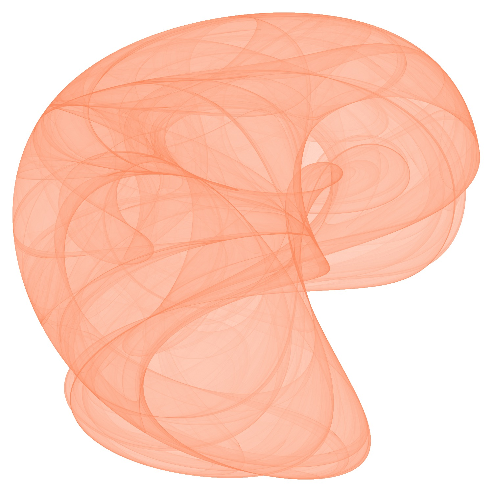
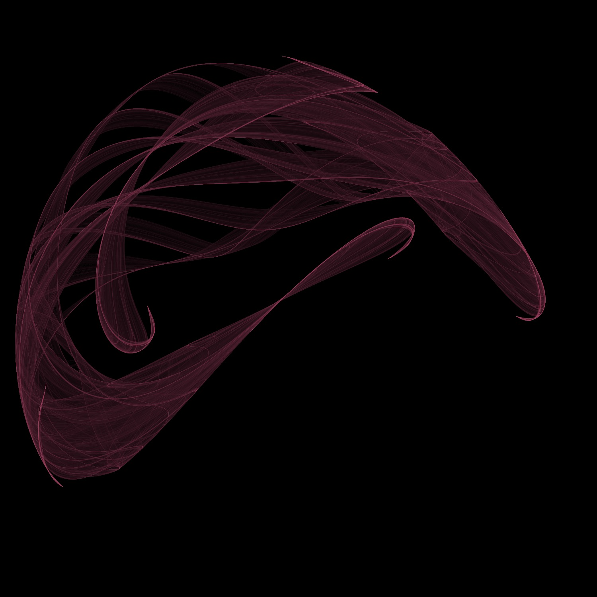
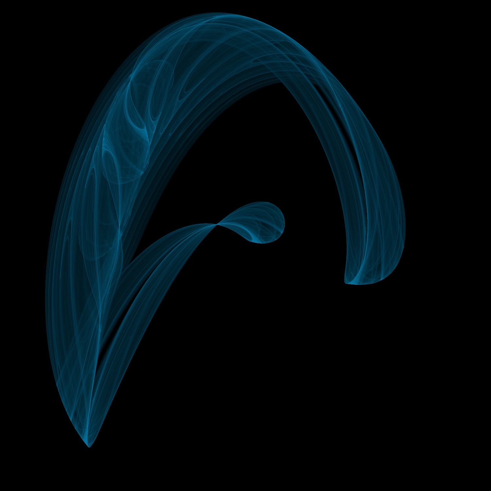
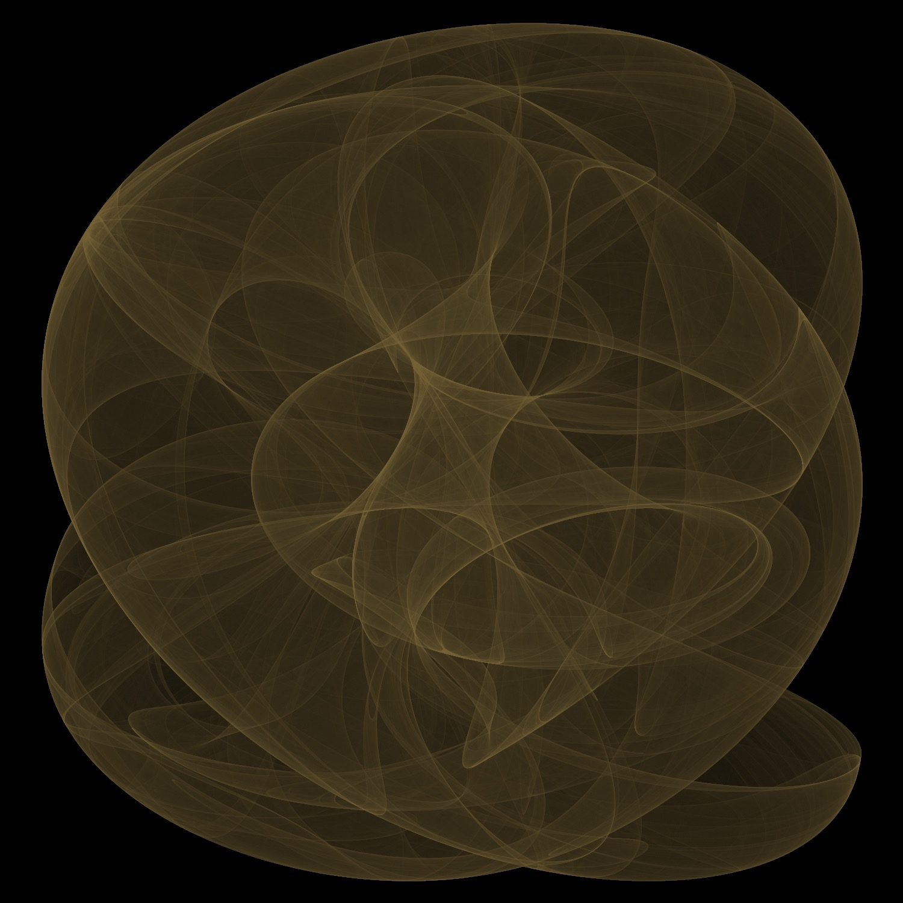

# Clifford Attractors in Julia

Because they are nice to look at. The implementation given should scale to high resolutions with many iterations. Rendering a billion iterations takes just over a minute on an ageing laptop.

## Make your own

Images here were made with Julia 1.0 using the Images, FileIO, Colors, FixedPointNumbers and Statistics libraries. All code is in `clifford_attractors.jl` with full explanations of variables you can play with.

## Samples
 
 

